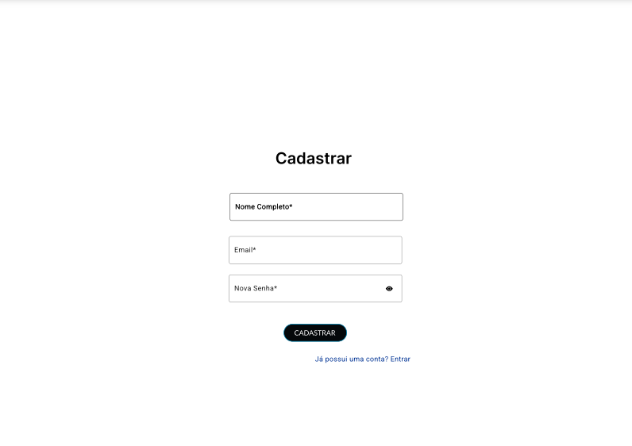
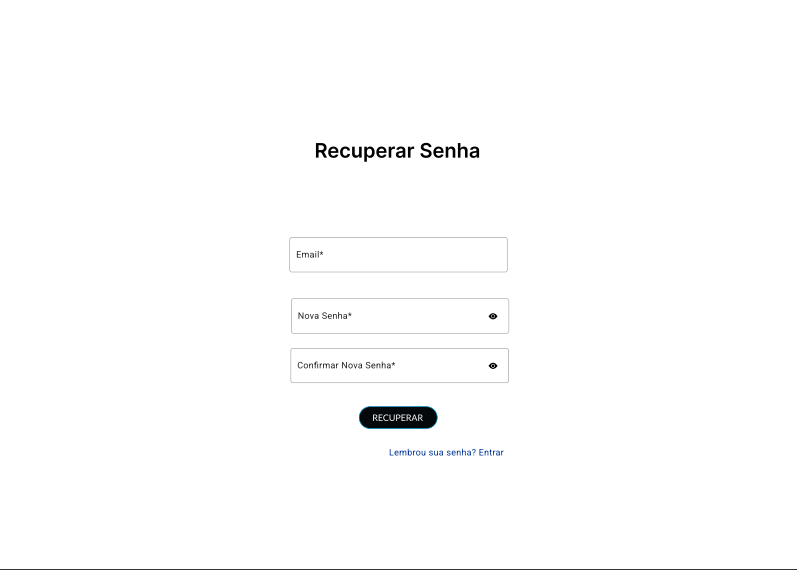
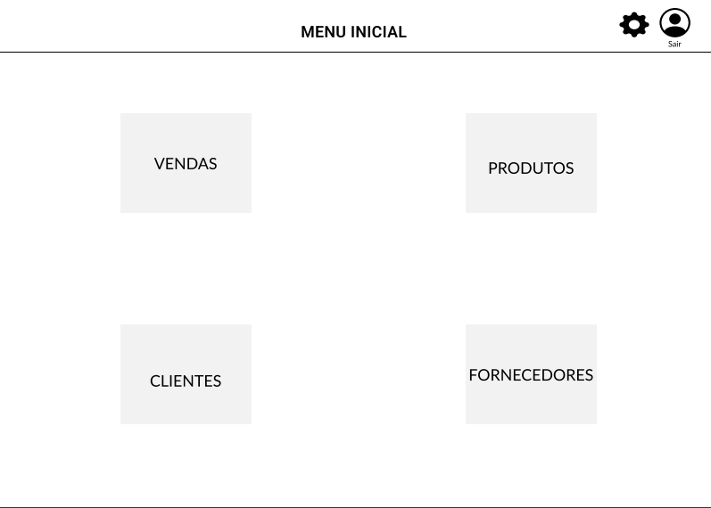
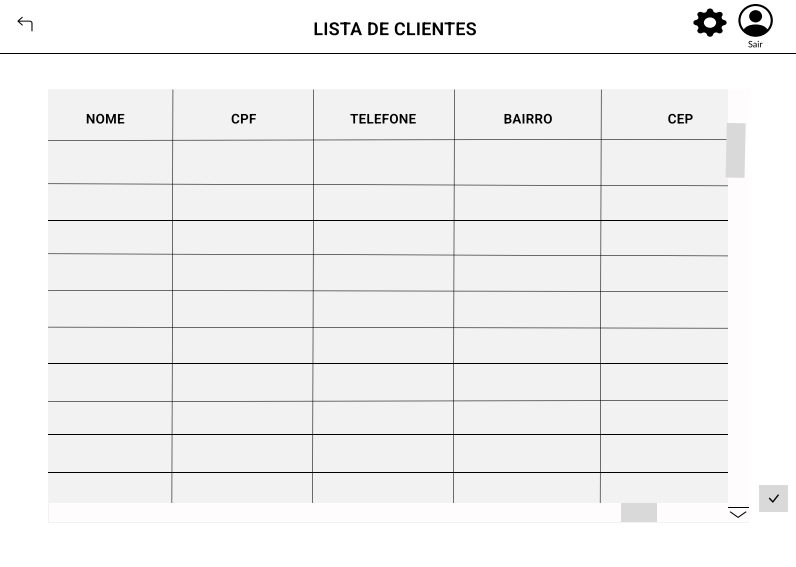
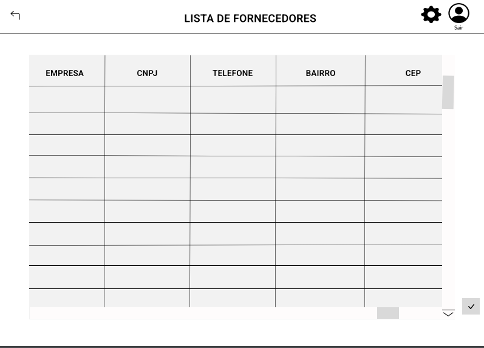
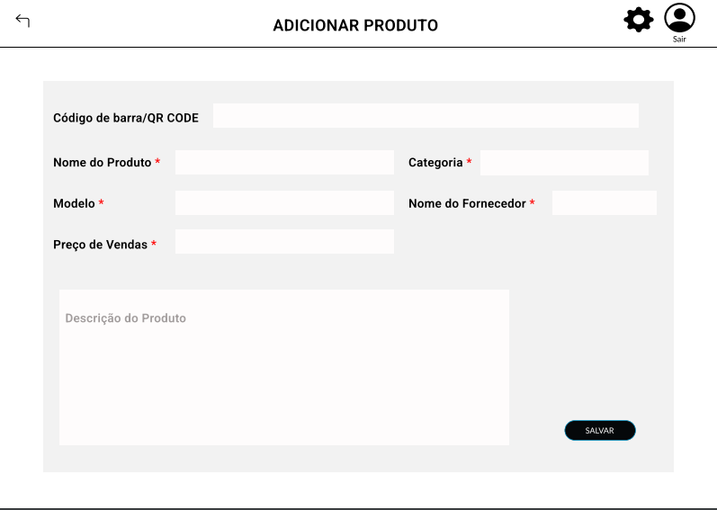
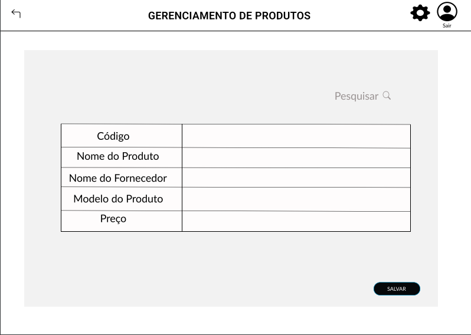
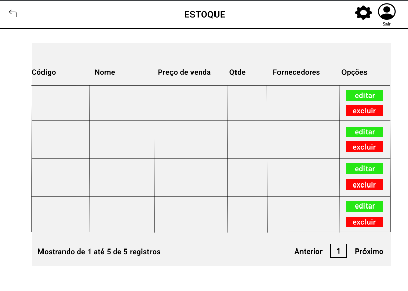
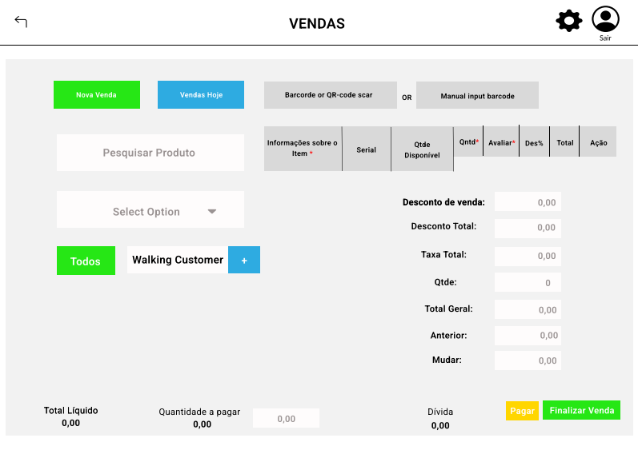

# Projeto de Interface

Pré-requisitos: <a href="2-Especificação do Projeto.md"> Documentação de Especificação</a>

Visão geral da interação do usuário com as funcionalidades que fazem parte do sistema sociotécnico (protótipo de telas).

# Wireframes

## TELA CADASTRO

## TELA LOGIN

## TELA RECUPERAR SENHA

## TELA MENU INICIAL

##TELA ADICIONAR CLIENTES

## TELA LISTA CLIENTES

## TELA LISTA FORNECEDORES

## TELA ADICIONAR PRODUTO

## TELA GERENCIAMENTO DE PRODUTOS

## TELA ESTOQUE

##TELA VENDAS 

